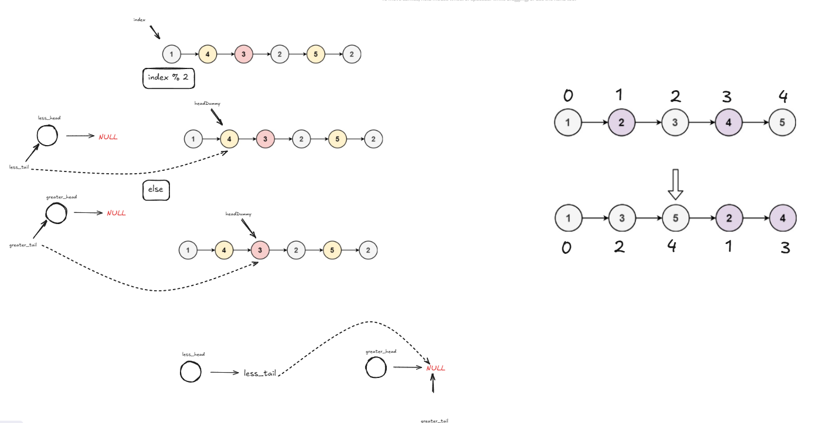

# OddEvenList

This section provides an overview and visual aid for this problem.

<details>
<summary>Click to view the Approach Diagram</summary>
<br/>



</details>

### Code
<!-- CODE_START -->
```cpp
ListNode* oddEvenList(ListNode* head) {
        struct ListNode* even_head = (struct ListNode*)(malloc(sizeof(struct ListNode)));
        even_head->next = NULL;
        struct ListNode* odd_head = (struct ListNode*)(malloc(sizeof(struct ListNode)));
        odd_head->next = NULL;

        struct ListNode* even_tail = even_head;
        struct ListNode* odd_tail = odd_head;            
        struct ListNode* tail_dummy = head;

        int index = 0;

        while(tail_dummy){
            if((index)%2){
                odd_tail->next = tail_dummy;
                odd_tail = odd_tail->next;
            }
            else{
                even_tail->next = tail_dummy;
                even_tail = even_tail->next;                
            }
            index++;
            tail_dummy = tail_dummy->next;
        }

        ListNode* head_dummy = even_head->next;

        even_tail->next = odd_head->next;
        odd_tail->next = NULL;

        free(even_head);
        free(odd_head);   

        return head_dummy;
    }
```
<!-- CODE_END -->