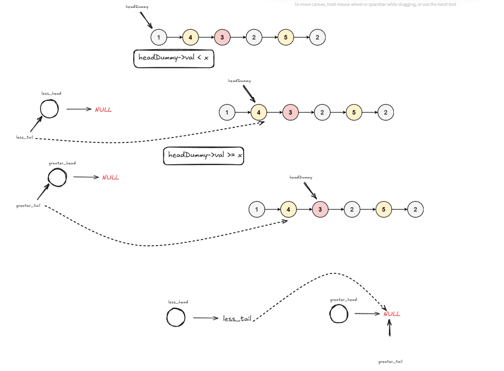

# PartitionList

This section provides an overview and visual aid for this problem.

<details>
<summary>Click to view the Approach Diagram</summary>
<br/>



</details>

### Code
<!-- CODE_START -->
```cpp
/**
 * Definition for singly-linked list.
 * struct ListNode {
 *     int val;
 *     ListNode *next;
 *     ListNode() : val(0), next(nullptr) {}
 *     ListNode(int x) : val(x), next(nullptr) {}
 *     ListNode(int x, ListNode *next) : val(x), next(next) {}
 * };
 */
class Solution {
public:
    ListNode* partition(ListNode* head, int x) {
        struct ListNode* less_head = (struct ListNode*)(malloc(sizeof(struct ListNode)));
        less_head->next = NULL;
        struct ListNode* greater_head = (struct ListNode*)(malloc(sizeof(struct ListNode)));
        greater_head->next = NULL;

        struct ListNode* less_tail = less_head;
        struct ListNode* greater_tail = greater_head;
        struct ListNode* headDummy = head;
        
        while(headDummy){
            if(headDummy->val < x){
                less_tail->next = headDummy;
                less_tail = headDummy;
            }
            else{
                greater_tail->next = headDummy;
                greater_tail = headDummy;
            }
            headDummy = headDummy->next;
        }

        greater_tail->next = NULL;
        less_tail->next = greater_head->next;

        ListNode* list_header = less_head->next;

        free(less_head);
        free(greater_head);
        return list_header;
    }
};
```
<!-- CODE_END -->