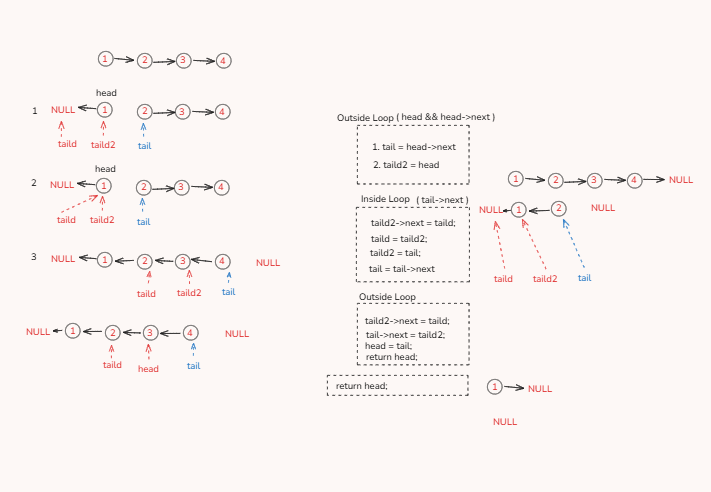

# ReverseList

This section provides an overview and visual aid for this problem.

Click to view the Approach Diagram

 

### Description

*(You can add a description of the problem solved in this folder here, e.g., "This folder contains the solution for reversing a singly linked list.")*

### Code

*(You can link to your code file here, e.g., `[Code.cpp](Code.cpp)`) *